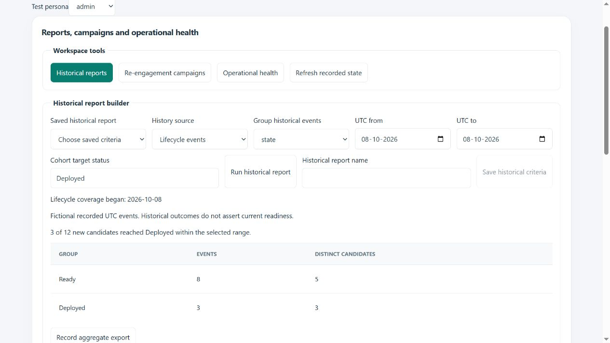
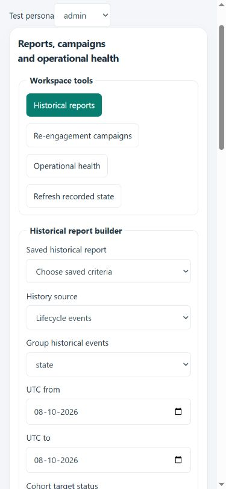

# Completion workflows milestone — 8 October 2026

This release completes six selected gaps found after the five dependent stages. It adds no external service and remains local until the migration and frontend are deployed together. It does not claim that every possible recruiting feature or every broad blueprint ambition is finished.

## Delivered features

| Feature | User experience and implementation |
| --- | --- |
| Searchable administration queues | Enterprise operations searches members, cases, retained plans and access history on the server before pagination. Candidate name, Anthro-ID and exact status/role searches retain existing administrator/MFA gates. |
| Cited CV records | CV evidence review builds editable records from excerpts, merges adjacent records, retains original line citations, checks partial dates and possible duplicates, and requires explicit review. Changing source labels invalidates review. These are reviewed claims, not independently verified credentials or automatic employment-journal updates. |
| Historical reports | Reports and Work hub provide recorded lifecycle/readiness aggregates, grouping, UTC date ranges, new-candidate cohorts, versioned saved criteria and audited aggregate JSON exports. Viewers read; editors export; administrators save definitions. Truncated reports must be narrowed before export. |
| Operational health | Administrators see queue age, overdue enabled mailbox sync, review/reconciliation work, recorded failures, acceptance renewal windows and native evidence expiry with recovery guidance. These are recorded signals, not live provider reachability or invented latency measurements. |
| Expanded custom fields | Interviews, assessments, enrichment and placements now accept typed workspace custom fields through their actual forms and show their values. Server validation, sealed-record protections and reviewed subject-access projections include them. |
| Reviewed campaigns | Internal editors preview every recipient, purpose, template version and UTC schedule before atomically enrolling a candidate. Up to five steps use the existing test outbox. Opt-outs, contact windows, source changes, current definition, linked candidate replies, offboarding and recovery lockdown suppress pending work. Stop actions retain completed evidence. |

Find reports, campaigns and health in the internal **Work hub**; historical reports also appear under **Reports**. Admin queue search is in **Enterprise operations**. Custom-field definitions use existing workspace settings. CV grouping is in **Structured CV evidence**.

## Boundaries and consistency

Campaign execution is **test-only**. No new live campaign sender is enabled. Existing separately configured Google Workspace individual workflows retain their own acceptance and transport gates. No account credentials, hosted migrations, production changes or GitHub push were performed.

Historical reports cover actually recorded events and decisions. They do not reconstruct unrecorded history, imply causality or infer current readiness. Cohorts count candidates created within the selected interval who subsequently had the selected transition/decision within that interval. Reports expose curated aggregates rather than raw contact, financial or free-text evidence.

Writes use scoped permissions, reviewed heads and operation receipts. Lost acknowledgements retain the exact retry request. Campaign enrollment freezes template versions, takes workspace/candidate locks and commits all steps atomically. A changed or paused definition cancels its old pending work. Candidate reply suppression uses the confirmed sender and Gmail reception timestamp; historical, sent, draft, spam, trash and bounce messages are excluded. Gmail `internalDate` semantics follow the [official Gmail message reference](https://developers.google.com/workspace/gmail/api/reference/rest/v1/users.messages).

The new private definitions table contains governance configuration rather than candidate activity. Campaign activity reuses existing private communication receipts/intents/attempts, preserving the 81 formal and 78 operations privacy categories. Typed values and CV records remain within existing candidate projections. Raw private helper and table access stays revoked; recovery guards apply to the new table. Migration replay is tested.

## Deployment and recovery

Apply **all 93 sorted migrations** through `20261008131516_completion_workflows.sql`, then deploy the frontend and existing **28 Netlify functions** together. The new public invoker RPC is `api_completion_workflows`; missing migration errors direct the operator to the migration rather than silently returning incomplete data.

Recapture privacy inventories, regenerate reviewed D6 access packages and refresh Stage 5 retention plans after migration because custom-field and interview projections changed, even though category counts remain unchanged. Capture `ecod_completion_private` and every earlier private schema, Auth, roles, sequences and retained receipts, alongside original private object versions and credential/key custody. The native recovery runner already discovers all `ecod%private` schemas.

Recovery lockdown suppresses future campaign steps and disables the test communications policy. Unlocking does not resume those steps: explicitly restore the applicable policy and review a new enrollment. Offboarding also suppresses future queued/retrying communication work immediately.

Hosted SQL advisors, real multi-connection concurrency, native worker recovery and actual provider acceptance remain deployment checks. Local embedded PostgreSQL and fictional browser fixtures do not substitute for these.

## Verification

Final validation: **1,058 Node tests passed**, zero failures, skips or cancellations (571 seconds); **5 private OCR Python tests passed**. ESLint and repository formatting checks passed. Offline Netlify packaging passed with **28 functions** and a **68.7 KiB main entry** against the 100 KiB budget. All **72 focused regression checks** also passed before the final run. The Node UI harness emitted React `act` warnings without failed assertions; browser fixtures recorded no console errors. Focused checks cover migration-chain replay, permissions, cross-workspace isolation, exact retries, atomic campaign enrollment, consent/duplicate suppression, real offboarding/lockdown APIs, historical cohorts, typed fields, subject-access projection, strict CV citations and actual React forms.

Browser review exercised the actual components with clearly labelled fictional RPC fixtures, including administrator and viewer controls, client exclusion, campaign preview/queue/stop, reports and a 390-pixel mobile layout. No browser console errors were recorded. Server behavior is checked separately by executable SQL tests.

