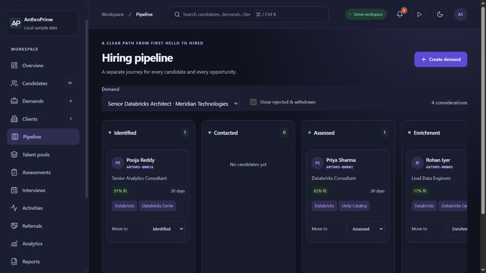

# Final session audit

Date: 8 October 2026. Baseline: `80a7ee1` on `codex/technical-improvements`. The user authorized this final audit, fixes and a GitHub push after validation. This report supplements the earlier milestone, completion and UI audit records; it does not replace their stated production acceptance limits.

## Findings and fixes

Malformed CV evidence imported through older or manually edited local backup data could crash candidate review. The existing validator reported an error, but rendering still attempted to iterate non-array records, dereference null records and join invalid citations. The duplicate detector also assumed string labels and organizations. Rendering now checks structural readability before accessing those fields. Editors can rebuild invalid groupings from the retained original excerpts; rebuilt records require fresh review. Read-only callers see an actionable warning without repair controls.

Malformed excerpts now show a re-extraction warning instead of crashing or approving incomplete claims. Explicit invalid record values, including `false`, `0` and `null`, cannot bypass the client review gate by being falsy. Semantic errors such as impossible dates remain editable, while confirmation stays disabled until corrected. Existing server validation remains authoritative and unchanged. No migration or service was added.

Two added React regressions exercise malformed groupings, citations, missing fields, read-only behavior, preservation of original evidence, renewed review, invalid date correction and malformed excerpts. The existing completion/domain regressions cover valid grouping, duplicate detection, partial dates, merging, citation integrity and invalidation after editing.

## Workflow and role evidence

The full regression suite exercises actual React components and embedded PostgreSQL with the 93-migration chain. Relevant coverage includes candidate identity and duplicate merges, imports, candidate forms, source review, CV extraction, assessments, enrichment, readiness, demand pipeline, interviews, applications and offers, reporting/export, communications and exact-operation retries, privacy requests, portals, integrations, offboarding and recovery. It includes migration replay, consent and source-change suppression, worker leases, endpoint authorization and redaction, private-schema permissions and cross-workspace boundaries.

The final-chain role matrix covers administrator, recruiter, viewer, assigned assessor, sales, candidate, client and anonymous callers. Positive assignment and portal tests complement denied general repository/private-worker access. Administrative MFA, policy gates, viewer read-only restrictions, sensitive projections and service-only worker boundaries are tested separately. UI visibility alone is not treated as proof of authorization.

Manual browser review used the production build and clearly labelled fictional local sample data. It verified Anthro-ID search, candidate details, editable profile controls, cancellation, pipeline navigation and a persisted stage transition with restoration to its original stage. At a 390 × 844 viewport, mobile navigation opened, Escape closed it and returned focus to its trigger, body scrolling was restored, and the document had no horizontal overflow. The screenshot below records the stable production pipeline after restoration. No production candidate data or external provider action was used.

## Validation

Final Node regression result: **1,063 tests passed**, zero failures, cancellations or skips, in 563 seconds. This includes the two new CV rendering regressions and the final-chain role matrix.

- Five private OCR Python tests passed.
- ESLint, repository formatting and explicit checks for the appearance bootstrap, shared stylesheet and four HTML entry points passed.
- Production bundle check passed: main entry 69.7 KiB against the 100 KiB budget. The lazy PDF engine still produces Vite's existing large-chunk advisory.
- Offline Netlify build passed and packaged all 28 functions.
- `pnpm audit --json` reported zero known vulnerabilities across all severity levels in the current lockfile. This is an advisory-database snapshot, not a guarantee of vulnerability absence. The repository uses pnpm; npm audit cannot operate without an npm lockfile, so no second lockfile was generated.
- `git diff --check` passed before final commit preparation.

## Acceptance limits

This is local code and workflow validation. Hosted Supabase advisors, actual native PostgreSQL multi-connection concurrency and disaster-recovery acceptance, Netlify runtime smoke tests, and live provider/account acceptance remain environment checks. Embedded SQL fixtures and offline function packaging cannot prove those outcomes. Provider fixtures and existing activation gates remain in place. Campaign execution remains test-only under its existing contract.

No hosted migration, provider activation or production data operation was performed. The authorized GitHub push targets the existing branch and preserves its history. A linked deployment system may independently build on that push; this session does not claim deployment acceptance or merge into the default branch.
