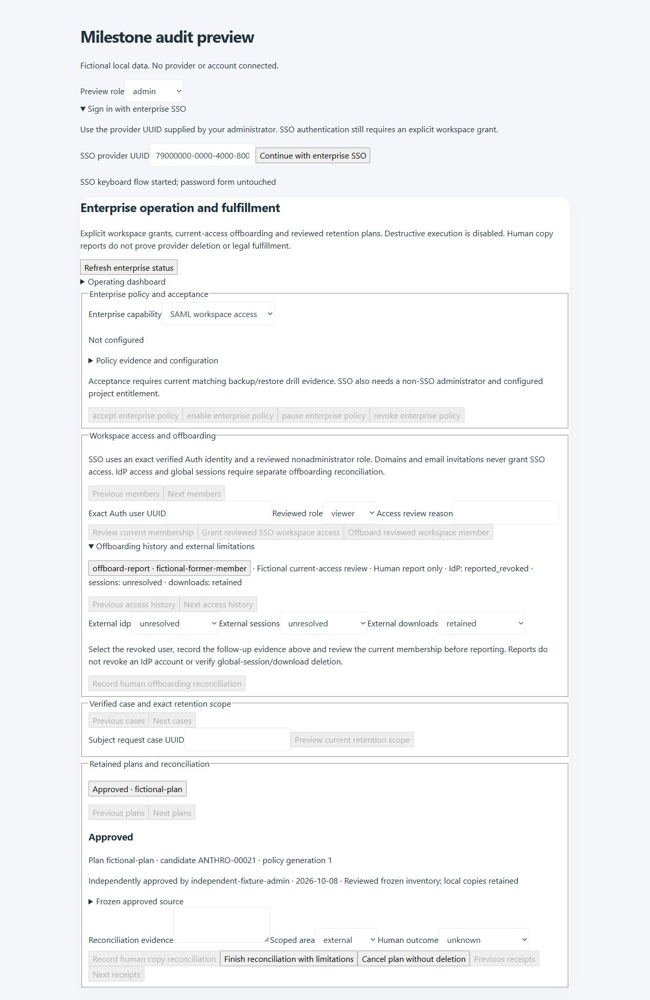

# Milestone integrity and role audit

Audit date: 8 October 2026. Baseline: local `bb1e8c5`, after all five dependent milestones. This review also covers the earlier independent milestones and foundation through the complete regression suite. Changes remain local; no GitHub push, hosted migration, provider activation or production data operation was performed.

## Scope and findings

Compared the original `ECOD_Talent_Intelligence_Repository_Product_Blueprint.docx`, independent completion/foundation records and the five dependent contracts with the current UI, repository/RPC wiring, workers, migration chain and tests. Reviewed identity and merges, imports and original documents, search/matching, assessments/enrichment/readiness, applications/interviews/offers, candidate/client portals, consent and restrictions, reports/export, integrations, access/offboarding and recovery. The assessment is of the implemented contracts; it does not imply every broader blueprint epic has production acceptance.

The local stage workflows are wired. This pass repaired these defects and review gaps:

| Finding | Result | Regression evidence |
| --- | --- | --- |
| Enter in an SSO input inside a password form could invoke the wrong form | Enter now prevents password submission and invokes SSO; busy/blank inputs are guarded | Native browser keyboard check and `ui-dependent-stage5.test.js` |
| SSO always returned to the staff root, losing the client portal | Exact `/client.html` return preserved; query tokens and arbitrary destinations are excluded; pasted UUID whitespace trimmed | Native-client request assertions in `ui-dependent-stage5.test.js` |
| Missing SSO URL exposed a technical URL exception | Stable actionable secure-redirect error | Missing/insecure response tests |
| Worker generation, outcome and fixture-state comparisons accepted SQL null in conditional expressions | Explicit null-safe generation/eligibility checks and required outcome/state values | Stage 4 database lease, completion and callback scenarios |
| Independent approval evidence was retained privately but unavailable to the next plan reviewer | Admin-only plan detail includes the original approving actor, time and evidence | Stage 5 database/UI tests, including replay of the audit migration |
| Offboarding reports hid the recorded IdP/session/download outcomes | History shows those human limitations and available authorship/time | Stage 5 UI test and native browser review |
| OAuth request size was checked only after parsing | Reject oversized UTF-8 bodies and base64 input before JSON parsing or ticket reservation | `audit-endpoint-boundaries.test.js` |
| Webhook scheduler failures escaped the endpoint without its own redacted response | Explicit uncached 503 with retained-job guidance; no error details exposed | Scheduler success/failure tests |
| Document failures logged the full storage error | Generic status-only logging avoids leaking personal data or signed URLs | Sensitive-error log and response test |
| README/deployment guide stopped at old migration endpoints | Current instructions include all stages through the audit, 92 migrations, 28 functions and provider activation links | Deployment documentation review |
| Windows checkout line endings caused widespread formatting-check failures | Prettier accepts the checkout's line ending convention; one existing wrapping issue corrected | Repository format check |

The additive CLI-generated migration is `20261008105844_milestone_integrity_audit.sql`. Apply it after Stage 5; do not edit or skip earlier migrations. It preserves function signatures, grants, security modes, retained records and Stage 5 current-actor checks. The chain now contains 92 migrations. No package, service or candidate-linked table was added, so the 81-category formal privacy inventory and 78-category planning inventory remain unchanged. The deferred migration-039 fixture now applies the audit only after its prerequisites in both migration passes.

## Role perspectives

Tests drive actual React components in a DOM and real SQL in embedded PostgreSQL, rather than trusting hidden controls alone. The additional final-chain matrix exercises all roles against current permission checks, cross-workspace access, private tables and service-only workers. Existing positive portal/assignment journeys complement those negative checks.

| Perspective | Exercised workflow and boundary | Principal tests |
| --- | --- | --- |
| Administrator | Policies/evidence/MFA, approvals, imports, private documents, scoped exports, member grants/offboarding, fulfillment and recovery; other workspace remains inaccessible | `migration-dependent-stage1/2/3/4/5.test.js`, `migration-privileged-mfa.test.js`, `ui-dependent-stage*.test.js` |
| Recruiter | Candidate creation and source review, search, pipeline, interviews, enrichment, communication preparation and independent drafts; financial and enterprise administration denied | `ui-app.test.js`, `ui-portals.test.js`, `migration-stage1-financial-boundary.test.js`, `migration-dependent-stage4.test.js` |
| Viewer | Repository/dashboard/history and personal views; writes, bulk edits, exports, integration activation and administration denied | `ui-viewer.test.js`, `ui-recruiter-worklist.test.js`, `migration-paged-repository.test.js` |
| Assigned assessor | Expiring exact-candidate assignment, limited professional projection and assessment submission; unrestricted repository and other assignments denied | `migration-stage1-assignments.test.js`, `migration-stage2-boundaries.test.js`, `ui-stage1.test.js` |
| Assigned sales/account role | Exact client/demand progress projection, expiring grants and revocation; candidate repository and evaluation authority denied | `migration-stage1-assignments.test.js` and final-chain matrix |
| Candidate/applicant | Public approved roles and consented applications, explicit account grant, own curated profile, pending assertions and preferences/opt-out; internal notes/financial/history and another candidate's links denied | `ui-portals.test.js`, `migration-stage4-feedback.test.js`, `ui-stage4-feedback.test.js`, `migration018/019.test.js` |
| Client | Provisioned account/demand grants, approved versioned packs and scoped feedback/surveys; other client/demand, candidate-private fields and revoked/expired access denied | `migration-client-review.test.js`, `migration-stage4-feedback.test.js`, `ui-clients.test.js` |
| Anonymous visitor | Public projections/application-code boundary; private repository, administration and worker APIs denied | `migration018/019.test.js`, `phase4-endpoints.test.js`, final-chain matrix |

External candidate/client accounts in the new matrix deliberately have no workspace membership: it proves they cannot inherit internal access. Their permitted positive journeys use the explicit grants in the existing portal tests. The browser role switch checks visibility of the actual enterprise component using fictional data; it is not a substitute for server authorization.

## Workflows and failure recovery

| Contract | Tested behavior |
| --- | --- |
| Durable identity | Compact five-digit Anthro-ID, collision/exhaustion handling, stable UUID references, merge aliases and preserved evidence/history |
| Repository and ECOD | Bounded/keyset pages, provenance, missing versus zero, currency segregation, hard constraints, independent validation and stale evidence |
| Imports/documents | Reviewed rows, resumable idempotent commits, bounded parsing, quarantined originals, infected blocking, exact extraction proofs, expiring signed access and audited exports |
| Sandbox delivery | Current consent/contact/source and owner gates, leased dispatch, lost acknowledgements, duplicate/reordered callbacks, bounded retry and ambiguous reconciliation |
| Processing/recovery | Accepted generation-bound evidence, recovery row/TRUNCATE freeze, current-owner checks, immutable private journals and fixture restore continuity |
| Google collaboration | OAuth/PKCE and sealed credential custody, source gates, DST/ambiguous time handling, mailbox/calendar cursors, channel checks, attachment quarantine and uncertain send recovery |
| Controlled workflows | Professional-only AI projection, literal grounding, shared budgets, policy versions, reviewed enrichment assertions, approved job exports, signing fixtures and unknown-outcome closure |
| Enterprise | Verified native identity/provider checks, signed authentication-method scan, invite isolation, explicit grants, workspace offboarding, human external limits and independent frozen retention scope |

Initial Google worker setup errors leave the unstarted lease for existing expiry recovery. Errors after a possible provider write retain ambiguity and reconciliation. They must not become automatic duplicate sends. Unknown outcomes and human external reports remain visibly distinct from verified delivery, legal signatures or deletion.

## Netlify function coverage

All 28 shipped Netlify function entry points now have direct automated test references; their shared adapters and SQL workers are covered separately. A direct reference is a coverage inventory, not a claim that every branch or real network condition was executed.

| Entry points | Test coverage |
| --- | --- |
| `approved-job-feed`, `machine-api` | `phase4-endpoints.test.js` |
| `controlled-workflow-run`, `controlled-workflow-callback` | `controlled-workflows.test.js` |
| `cv-upload-url`, `cv-extract-worker` | `durable-cv.test.js`, private attachment/scanner tests |
| `document-upload-url`, `document-download-url`, `document-reputation` | Storage, audited access, private attachment/scanner and VirusTotal tests |
| `delivery-sandbox-worker`, `delivery-sandbox-callback`, `delivery-sandbox-diagnostic` | `delivery-sandbox-functions.test.js` |
| `google-oauth-start`, `google-diagnostic`, `google-collaboration-worker` | New endpoint-boundary tests; collaboration adapters also in `google-workspace.test.js` |
| `google-oauth-callback`, `google-calendar-callback` | `google-workspace.test.js` |
| `execution-worker`, `freshness-review-worker`, `interview-reminder-worker`, `test-communication-worker` | Corresponding worker tests |
| `import-worker`, `index-worker` | Durable import and index worker tests |
| `integration-candidate`, `intelligence`, `linkedin-candidate` | Integration/intelligence, controlled workflow and LinkedIn import tests |
| `subject-access-cleanup`, `webhook-worker` | Subject-access and new endpoint-boundary tests |

## Verification record

Final complete regression result: **1,038/1,038 passed**, zero failures, cancellations or skips; 547.2 seconds. This final verification supersedes the earlier changing-tree run, which is not counted as a pass.

- A final small SSO input-length correction prevents pasted whitespace from truncating the UUID; all nine Stage 5 UI tests passed after that adjustment. The full regression above preceded this isolated adjustment.
- Focused Stage 4/5 migrations, deferred migration-039 and UI/endpoint checks passed after correcting the new role test's required RPC argument. The final-chain eight-role matrix also passed.
- Python private OCR suite: 5/5 passed, including input/page/tool/resource boundaries.
- Offline structured-output evaluation: 12 cases, 44 literal highlights, no schema/safety failures, 100% literal grounding. Human utility and live-provider quality are not inferred from these fixtures.
- ESLint and repository Prettier check passed.
- Offline Netlify build/package passed with all 28 functions and a 68.6 KiB main entry under the 100 KiB budget.
- Native browser: actual enterprise/SSO components under React Strict Mode with fictional local RPC responses; Enter invoked SSO without password submission, retained approval and offboarding limits were visible, all six nonadmin roles hid the admin panel. At 390 pixels, document width was 375 pixels with no horizontal overflow; no console errors observed. Temporary preview source, server and tab were removed.
- `supabase db advisors --local` could not connect to `127.0.0.1:54322`. This is an unavailable native environment, not a passed advisor result. Embedded SQL tests do not replace native Auth/PostgREST/concurrency/advisor acceptance.

## Remaining acceptance and broader scope

There is no unimplemented local slice identified in the five agreed dependent contracts after these fixes. Their completion still has external boundaries:

1. Hosted migrations, native Supabase Auth/RLS/MFA/session tests and real multi-session races need an authorized staging environment. This audit did not deploy.
2. Google Workspace app/account/scopes, real diagnostics and calendar/mail acceptance remain account operations. Fixture transport proves handling, not actual delivery.
3. Private ClamAV/OCR infrastructure, fresh signatures, actual original-object storage and offsite backup/key custody require deployed infrastructure and operators. Real isolated restores and RPO/RTO acceptance remain essential.
4. OpenAI/PDL/VirusTotal need approved credentials, permissions, budgets and applicable entitlements. Their absence does not justify bypassing gates or substituting unlicensed scraping.
5. SAML needs the native configured provider, entitlement, certificate lifecycle and a tested non-SSO administrator. Workspace offboarding does not revoke every external account/session/download.
6. Job publishing and offer signing remain the selected approved-feed/provider-neutral fixture contract. Real vendor posting and legally effective signing require a separately chosen and accepted adapter.
7. Retention completion is human reconciliation with limitations. Destructive erasure remains deliberately disabled under the original contract; the wider DOCX's physical deletion/anonymisation and legal fulfillment are not declared complete.
8. Production-scale 200-CV ingestion, real end-to-end customer UAT and production latency/restore evidence remain deployment acceptance. Bounded local workload tests are not production benchmarks.

Conditional SMS/WhatsApp, background checks, additional providers, SCIM/group provisioning and broader analytics/product expansions remain later scoped work. The audit does not convert them into mandatory local-stage omissions or claim the whole blueprint is production fulfilled.

Relevant native API references were checked through the Supabase documentation connector: [project SAML SSO](https://supabase.com/docs/guides/auth/enterprise-sso/auth-sso-saml), [JavaScript signInWithSSO](https://supabase.com/docs/reference/javascript/auth-signinwithsso). Latest milestone records retain the live acceptance and rollback procedures.
