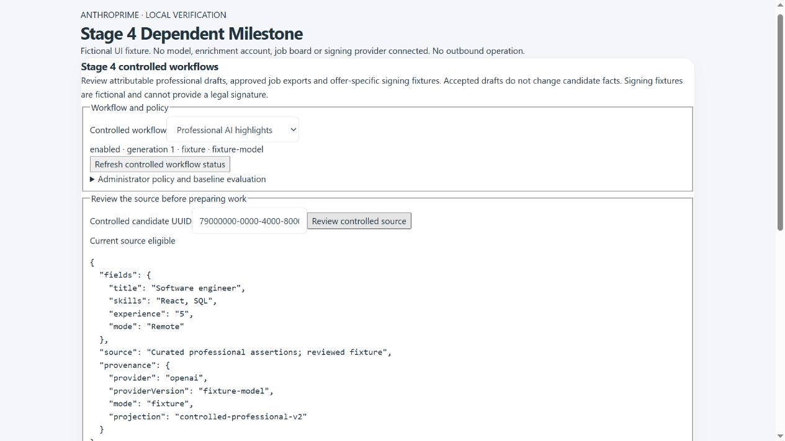

# Stage 4 Dependent Milestone — controlled intelligence and external workflows

Implementation contract, 8 October 2026. This continues Stage 3 on Netlify/Supabase. Local commits only; no provider activation, deployment or outbound operation is included.

## Scope and build order

1. Versioned policies for AI, enrichment, approved job exports and offer signing: administrator owner, purpose, rights/processing evidence, provider version, budgets, mode and acceptance. Model evaluation compares deterministic/manual baselines and records safety/grounding and utility separately. Local fixtures cannot establish live provider acceptance.
2. Candidate professional projection, frozen review heads, exact operation receipts, bounded quotas, cancellation, leased final network authorization and ambiguous-outcome handling. Never use AI for automated eligibility, rejection or employment decisions.
3. OpenAI structured, attributable professional highlights and licensed People Data Labs enrichment. Preserve generated originals, editable revisions and independent review. No scraping, hidden identity/contact/financial disclosure or automatic fact application.
4. Approved-feed job export connector with immutable versions, current-content approval, source revocation checks, exact application attribution and separately labeled human reports of external posting/withdrawal. Vendor push is unavailable until a permitted API is selected.
5. Offer-specific signing packets bound to current approved terms, confirmed recipient and recruiting consent/holds. Provider-neutral fixture envelope, authenticated duplicate/reordered callback intake and reconciliation; preserve prior versions. Fixture completion is not a legal signature and never accepts an offer automatically.
6. Work hub, settings and candidate profiles, privacy inventories, recovery lockdown, negative tests, deployment packaging, activation/rollback instructions and local milestone commit.

## Acceptance record

Locally implemented on 8 October 2026. The user selected provider-neutral contracts and fixtures for publishing/signing. Live models, PDL account rights, job-board API and signing vendor acceptance remain separate dependencies. Deterministic/manual workflows remain available. Hosted acceptance is not implied by local completion.

## Implemented behavior

| Area | Delivered | Activation boundary |
| --- | --- | --- |
| Control plane | Four versioned policies; administrator ownership, rights, processing and cost evidence; baseline evaluation, acceptance, enable/pause/revoke; fresh authority and recovery gates | Privileged MFA, actual operating evidence and representative evaluation before live use |
| Professional AI | Deterministic fixture and fixed OpenAI Responses adapter; strict JSON, exact source quotations, model-version check, missing-evidence fields, immutable originals/revisions and independent review | Server API key and approved exact model snapshot; live evaluation must improve on the recorded baseline |
| Enrichment | Reviewed existing LinkedIn profile, fixed PDL v5 endpoint, professional-only result projection and matched-profile checks | Licensed account, permitted purpose, current live policy, server key and existing enrichment opt-in |
| Publishing | Current approved public demand projection, retained approved-feed JSON versions and application attribution | Export is available; vendor posting requires a later permitted API adapter. Human posted/withdrawn reports remain explicitly unverified |
| Signing | Approved offer terms, current confirmed recipient and recruiting consent, administrator-only packets, neutral fixture envelope and authenticated callbacks/reconciliation | Fixture only. No legal signature, provider dispatch or automatic offer acceptance; live signing needs a selected vendor |
| Experience | Work hub, administrator workflow settings and both candidate-profile implementations; searchable paged source pickers, preview, prepare, history, versions, reviews and uncertainty resolution | Cloud administrators/recruiters; signing restricted to administrators. Hidden in local/viewer/limited modes |
| Privacy/recovery | Candidate-linked work, revisions, events and receipts in inventories; tenant restrictions, recovery write/TRUNCATE guards and paused policy restoration | Existing Stage 2 native restore and hosted privacy acceptance remain required |

No automatic candidate fact updates or hiring/eligibility decisions are introduced. AI cites only title, skills, experience and work mode; identity, contact, financial data, employers, raw CVs and internal notes are excluded from that request. Enrichment assertions are labeled unverified. Approved job exports exclude internal client/budget fields. Signing snapshots include the authorized recipient and approved terms because they are required for that workflow, and exclude internal offer notes.

## Reliability and review contract

Preparation freezes the source, original policy, projection and provenance. A changed source, policy generation, authority, consent or hold prevents dispatch. Operation receipts bind the exact workspace, actor, request and review head; an acknowledgment failure must be retried with the same operation, not a newly generated operation. The UI freezes pending controls accordingly.

Dispatch has a 24-hour preparation deadline, a 45-second lease and a final authorization gate before provider I/O and result acceptance. Completed drafts remain reviewable after the dispatch deadline while their current policy/source gates remain valid. An independent reviewer can reject an obsolete draft with a reason; acceptance and edits require current eligibility. Original generated content and every edit remain retained versions. Review never writes candidate facts.

Daily limits are 1–100 reservations per kind, including failed/cancelled work and applicable legacy AI/enrichment reservations; these limits are not billing reconciliation. A started operation with a missing/late acknowledgment becomes uncertain, with no blind rerun. Even a configuration failure after dispatch begins can conservatively require administrator closure. Closure requires evidence and does not assert provider success, absence of charges or verified delivery. Pausing/revoking and source changes also prevent stale acceptance.

History/catalog/version pages contain 25 items with bounded offsets. Source snapshots are capped at 20 KiB, provider JSON at 64 KiB and fixture callbacks at 4 KiB; provider fetches have 10-second timeouts and reject redirects. Fixture callbacks authenticate the exact raw body with HMAC, accept a five-minute timestamp window, deduplicate event IDs, bind generation/envelope, and handle reordered completion events without downgrading a completed fixture. Fixture status never changes the underlying offer to accepted.

## Operator setup and evaluation

1. Apply `20261008092747_dependent_stage4_controlled_workflows.sql` after the existing migration chain, then deploy both new functions through a source-based Netlify build. This stage brings the local chain to 90 migrations. Never expose the service-role key or provider secrets to Vite/browser configuration.
2. Open the controlled-workflows panel in the work hub/settings. Configure an administrator owner, purpose, permission/processing evidence, cost decision, version, mode and budget. Use `fixture` first: it requires no external account and performs no provider I/O.
3. Run `node scripts/stage4-evaluation.mjs` for the 12 deidentified literal/schema fixtures. Optional independently produced provider results can be supplied as a bounded JSON file. The dataset hash is `76eb8d9dec9d199a6222aaf071868b08ba039e13df98d522c632a1eaf20773e5`. Fixture output has 44 literal highlights, zero literal/schema failures and 100% literal grounding. Utility values are deliberately null: this does not establish semantic quality, fairness or model benefit. Independently review representative baseline/provider results and record actual utility, failures, grounding and evidence against the dataset hash. At least ten cases are required; live AI acceptance requires strictly greater utility than the baseline, zero recorded safety failures and full recorded grounding.
4. Accept the current evaluation/policy and enable it with privileged MFA. Acceptance expires after 30 days. For live AI set the server `OPENAI_API_KEY` and exact approved model version; the optional policy `embeddingModel` defaults to `text-embedding-3-small` and must agree with the configured legacy embedding model. Existing embedding/search calls also require a current live AI policy. Unstructured legacy draft generation is disabled; historical drafts remain readable/reviewable.
5. For live enrichment configure the existing PDL server key and `LINKEDIN_ENRICHMENT_ENABLED`, verify account rights and accept a live `pdl-v5` policy. Legacy lookup calls also pass the new policy/quota gates. New controlled enrichment requires a reviewed existing candidate profile URL; no scraping or automatic creation/identity replacement is added.
6. Publishing uses `approved-feed-v1` with approved attribution. Source review requires an open public demand and an approval hash matching current content. Download the approved JSON; external publication/withdrawal must be separately reported with evidence. A changed/revoked source blocks another download; retained versions and external-copy reports remain available for audit.
7. Signing uses `neutral-sign-v1`, fixture mode and an explicit currency. Offer approval must match exact terms; recipient confirmation must be current (within 365 days), consent valid, and opt-out/holds absent. Optionally configure `CONTROLLED_FIXTURE_CALLBACK_SECRET` with at least 32 characters for server-side fixture tests. Send a signed timestamped fixture event to `controlled-workflow-callback`; this is a fixture protocol, not a vendor signature-verification protocol.

The service-only worker owns provider dispatch; authenticated users cannot invoke it directly. Public RPCs call guarded private functions. Raw tables have RLS and no authenticated/anonymous access. Configuration, evaluation, acceptance and signing enforce privileged MFA; generated-draft acceptance requires a reviewer different from the original requesting actor.

## Deployment, privacy and rollback

The formal privacy inventory is now 78 categories, and operational inventory is 75; four candidate-linked journal categories were added. Policies/evaluations retain aggregate evidence only: do not paste identifiable evaluation cases into those fields. This stage creates no new object-storage bucket. Privacy export/retention, external copies, hosted authorization and off-site backup handling retain their existing review/activation requirements.

Recovery lockdown pauses all four policies and blocks protected writes including TRUNCATE. Unlocking does not automatically reactivate them. To roll back provider activity, pause/revoke policies, disable legacy enrichment opt-in and remove the corresponding server credentials. Retain immutable work/version receipts for reconciliation; do not assume pausing deletes provider-held data or external job copies. Follow Stage 2 recovery/key-custody procedures for native backups/restores.

Offline Netlify packaging passed with 28 functions, including `controlled-workflow-run` and `controlled-workflow-callback`. The frontend main bundle remains 68.5 KiB under its 100 KiB limit. A Windows offline archive is packaging evidence, not a Linux hosted runtime or live provider acceptance result. Native Supabase/PostgREST, real OAuth/MFA, concurrency, permitted accounts, production latency and restore acceptance must be checked in staging before enabling live policies.

## Verification evidence

The focused 38 checks cover schema/authority, tenant boundaries, strict evaluation inputs, exact literal output, independent review, expired dispatch versus retained review, quotas, source revocation, ambiguous leases, immutable versions, callback authentication/replay/order, privacy/recovery and UI Strict Mode/frozen retries. Full regression passed **1,007/1,007**, with no skips or failures (561.7 seconds). Final ESLint and formatting of changed JavaScript/JSX/MJS files passed. The final matched-profile request correction passed its ten provider/endpoint/evaluation tests separately. Browser inspection exercised the actual component in a fictional local preview: source review exposes preparation, no console errors were observed, and a 390-pixel viewport had no horizontal document overflow. Temporary preview files/server were removed.

Implementation follows the official [OpenAI structured-output contract](https://developers.openai.com/api/docs/guides/structured-outputs) and [Supabase API security guidance](https://supabase.com/docs/guides/api/securing-your-api). Current [Postgres minor-upgrade breaking changes](https://supabase.com/changelog/postgres-15-19-17-11-breaking-changes) were checked; the migration does not introduce the affected legacy crypto or extension operations.

The PDL adapter explicitly requests matched-input evidence and a restricted response field list, as defined by the official [PDL enrichment parameters](https://docs.peopledatalabs.com/docs/input-parameters-person-enrichment-api). Native `supabase db lint --local` could not connect to `127.0.0.1:54322`; native database lint therefore remains unverified, separate from the embedded PostgreSQL migration/security tests.
