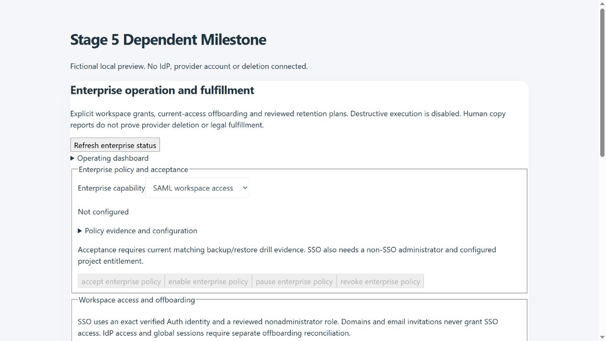

# Stage 5 Dependent Milestone — enterprise operation and fulfillment

Implementation record, 8 October 2026. Baseline: Stage 4 local commit `bba2699`. This completes the local Stage 5 build contract on the existing Netlify/Supabase stack. No hosted migration, deployment, real IdP connection, external revocation, erasure, or GitHub push is included.

## Delivered scope

| Feature | Implementation | Live boundary |
| --- | --- | --- |
| Enterprise sign-in | Native Supabase `signInWithSSO` by administrator-provided provider UUID on staff and client login screens; secure redirect and actionable unavailable state | Configured project SAML provider, entitlement, approved redirect URLs and actual IdP acceptance |
| Workspace mapping | Unique provider-to-workspace registration, versioned owner/evidence policy, native provider registry check and exact verified Auth identity grant | Explicit administrator grants by Auth user UUID; no domain auto-join, email linking or automatic administrator grant |
| Current authorization | Managed SSO membership requires enabled fresh mapping, matching signed `amr` SAML provider and current Auth identity; scans all authentication methods so MFA ordering is safe | Native Auth/PostgREST tests still required; IdP disablement alone is not assumed to invalidate issued JWTs |
| Offboarding | Exact current-head decision; membership removal, assignment revocation, owned Google credential/connection revocation, pending OAuth-state invalidation and queued work suppression | Workspace access is removed; global Auth sessions, IdP accounts, devices and downloaded copies need separate operational follow-up |
| Access history | Paged grants/offboarding receipts and explicit human IdP/session/download reconciliation reports | Human reports are retained as reports, never provider-verified revocation |
| Operating dashboard | Aggregate delivery, Google, controlled-workflow and fulfillment states, open subject-request count, recorded restore timestamp and recovery status | Recorded states do not demonstrate live reachability, delivery, current backup health or complete fulfillment |
| Retention plans | Current verified erasure/retention case, frozen professional inventory, identity family, current processing/document holds, versioned policy, independent administrator approval | Authorized planning and human reconciliation only; no destructive executor or automatically derived deletion eligibility |
| Fulfillment receipts | Scoped area decisions, immutable operation receipts, paged history, stale-scope rejection, cancellation and completion with explicit limitations | All local data/held copies preserved; external removal remains a human assertion |
| Experience | Work hub and Settings administrator panels; searchable existing case/member pages, typed evidence controls, exact retry after lost acknowledgment, retained sources and receipt pages | Cloud administrators only; hidden for recruiters, viewers, limited roles and local mode |
| Governance | Private RLS tables, guarded RPCs, existing privileged MFA, recovery row/TRUNCATE protection and updated privacy inventory | Native advisors, Auth, session concurrency and isolated restore drill acceptance remain staging prerequisites |

The stage adds no package, external service, environment credential, worker or Netlify function. The offline package still contains 28 functions. The migration chain now contains 91 SQL migrations.

## Architecture and authority

`20261008101818_dependent_stage5_enterprise_fulfillment.sql` adds private policies, managed-member/offboarding records, candidate plans, copy decisions and exact operation receipts. Tables are unavailable to ordinary authenticated/anonymous clients; public invoker RPCs call private functions guarded by current administrator membership and the existing privileged-MFA policy. Do not expose service-role keys to browser settings or Vite variables.

SSO authentication and application authorization remain separate. Supabase validates SAML. The app uses the current Auth user UUID and a native `auth.identities` provider match, plus the signed authentication-method provider; it never trusts editable `user_metadata`. SSO signup does not inherit email invitations. Explicit grants are limited to viewer/recruiter/assessor/sales; subsequent administrator provisioning requires a separately reviewed native administration procedure. Same-email password and SSO accounts are not silently linked. One provider UUID maps to one workspace in this stage; multiple IdPs or automatic group/SCIM provisioning are later vendor-specific work.

Workspace selection, raw write permission checks and the existing delivery/Google/controlled-workflow worker gates honor current managed-member authority. An offboarded UUID cannot implicitly rejoin through ordinary membership APIs. Explicit reviewed SSO reactivation is possible with a new current head, a current verified identity and an enabled policy. The last administrator is preserved, self-offboarding is rejected, and SSO acceptance requires an independent non-SSO administrator for recovery. These controls do not revoke access to other workspaces unless separately authorized there.

Operation receipts bind actor, workspace, operation UUID, payload and reviewed head. A lost response leaves the form frozen; the user can retry the identical operation or discard pending controls and reread current state. Replaying an old successful grant returns its historical receipt without reinstating access after a later offboarding. Work already leased or started retains the earlier stages' uncertainty handling; it is not represented as safely cancelled after a possible external side effect.

## Retention and reconciliation contract

Preparation requires a current identity-verified `erasure` or `retention_review` case in verified/in-review/awaiting-action state. The snapshot binds case version/verification, current identity-family inventory, document holds, processing restrictions and exact policy generation/body. The policy records its owner, purpose, rights, entitlement, recovery reference, approved basis and retention interval (1–36,500 days). The interval is operating evidence, not an instruction to delete every older record; existing retention queues and subject-request decisions remain separate reviewed workflows.

Approval requires another current workspace administrator and evidence. Candidate family, case and workspace decisions are locked during validation. A changed source, merge, case verification/version or policy makes the plan stale. Stale plans can be cancelled and replaced; they cannot be accepted against an old preview. Changing an old policy does not rewrite retained plan sources.

Local categories can only be retained, excluded or recorded unknown. Existing records cannot be labeled not-applicable. A human reported-removal outcome is restricted to original objects/external copies and is forbidden when processing or document holds exist. Backups cannot be labeled removed by this workflow. Every populated category plus `objects`, `external`, `backups` and `unlinked` needs a receipt before completion. Completion is named **Reconciled with limitations**, including when limitations remain unknown; it never means erasure performed or legal fulfillment verified. The existing case-close/D7 scope controls remain separate.

Plans and receipts do not invalidate their own frozen source: the planning inventory is a copy of the complete pre-Stage-5 inventory (78 categories). The formal inventory includes the three new candidate-linked journals (81 categories); operations inventory is now 78. New journals are explicitly excluded from automatic D6 content and remain available through separately reviewed private workflows. Policy/member records contain aggregate governance and staff access information, not candidate linked data. Future migration work must deliberately maintain this planning-inventory contract when adding another candidate source.

No candidate, document, object, external copy or backup is deleted by this stage. Retention holds are never released automatically. Receipt evidence must be a nonsecret operational reference; do not paste credentials, raw candidate files or third-party private records into it.

## Activation and rollback

1. Apply the full sorted chain through the Stage 5 migration, preserving all private schemas, Auth, sequence state, receipts and object-version/key-custody manifests in the existing Stage 2 recovery process. Test in an isolated restored environment. Native `db advisors --local` was unavailable locally because `127.0.0.1:54322` refused the connection.
2. Configure project SAML using the chosen IdP's verified metadata and Supabase's native provider administration. Verify the project's SAML entitlement, provider UUID, certificate lifecycle and staff/client redirect URLs. Keep automatic domain/email provisioning disabled. No IdP is selected or connected by this local implementation.
3. Preserve a tested non-SSO administrator account. Record real policy/evidence references and current matching backup/restore drill receipts in Stage 2. Stage 5 acceptance requires both passing backup and restore evidence for the current recovery generation within 30 days. Fixture tests inject fictional evidence for local verification; they do not prove a native restore occurred.
4. Configure the SSO policy in Enterprise operation and fulfillment; accept and enable its current head with privileged MFA. Sign in through the configured provider and grant the exact verified Auth UUID its reviewed nonadministrator role. Test wrong-provider, same-email alternate account, MFA ordering, certificate/OAuth expiry, raw reads/writes and cross-workspace behavior with real Auth/PostgREST. Acceptance expires after 30 days.
5. Offboard through a current membership review, then perform actual IdP/session/device/provider-copy follow-up through the relevant authorized account tools. Record what remains unresolved in Offboarding history and external limitations. Removing a workspace member is not global account deletion or an assurance that prior JWTs are invalid everywhere.
6. Configure/accept/enable the fulfillment policy with approved basis and recovery evidence. Open/verify the actual subject case using existing subject-request tools, preview current scope, prepare, obtain independent approval and record scoped copy decisions. Complete only as reconciliation with limitations; use existing case review controls separately. Destructive execution remains disabled by design.
7. Inspect the operating dashboard and earlier Stage 1–4 health/lease controls; do not enable an outbound integration based on aggregate counts. Check real native concurrency, operator/MFA revocation, recovery pauses, retention holds, source changes and private journal restoration before a hosted pilot.

Rollback: pause/revoke the policy with its current head, preserve break-glass access, and retain journals for audit. A paused/revoked SSO mapping denies managed access and dispatch gates; do not turn it off without a tested non-SSO administrator. Recovery lockdown pauses both enterprise policies and they remain paused after unlock. No key, external account, downloaded file or backup is automatically deleted during rollback. Rolling back the UI alone does not restore removed memberships or undo offboarding.

## Verification

New database scenarios cover administrator/tenant/MFA/private grants, registered provider and verified identity, email-invite isolation, authentication-method ordering, editable metadata rejection, raw write authorization, offboarding/implicit-rejoin denial, retained human external reports, exact case/source heads, independent approval, copy/backup restrictions, completeness, stale cancellation, aggregate dashboards, inventories, idempotent migration and row/TRUNCATE recovery freeze. Six React/native-client tests cover hidden roles, Strict Mode, source preparation, frozen exact retries, human limitation labels and native SSO redirect/error behavior. The latest focused database run passed 28 checks including Stage 3/4 and the deferred migration-039 fixture; the latest Stage 5 database/UI run passed 14.

The complete regression run passed **1,021/1,021 tests**, with no failures or skips (549.8 seconds). The final native-provider-removal guard was subsequently covered by the 14 Stage 5 database/UI checks. ESLint passed without warnings. Offline Netlify source packaging passed with 28 functions and a 68.6 KiB main entry under its 100 KiB budget. Browser inspection used the actual component under React Strict Mode with fictional local RPC data: retained plan controls opened, no console errors were observed, and a 390-pixel viewport had no horizontal document overflow. Preview files/server were removed. Screenshots show fictional local data and do not prove live acceptance.

## Primary references checked

- [Supabase project SAML SSO](https://supabase.com/docs/guides/auth/enterprise-sso/auth-sso-saml): provider administration, separate SSO identities, UUID identity and authentication methods. This is project/application SSO, not Supabase organization/dashboard SSO.
- [Supabase JavaScript signInWithSSO](https://supabase.com/docs/reference/javascript/auth-signinwithsso): native provider UUID flow; installed client types were checked for explicit redirect handling.
- [Supabase changelog](https://supabase.com/changelog): recent auth/security/platform changes reviewed. The relevant [Postgres minor-upgrade notice](https://supabase.com/changelog/postgres-15-19-17-11-breaking-changes) introduces no legacy-crypto or affected extension operation in this migration.

Live configuration, native database/session checks, actual restore drills, external revocation and legally authorized destructive fulfillment remain external acceptance/operating dependencies. All five dependent stages are locally implemented; that does not declare every external dependency activated.
