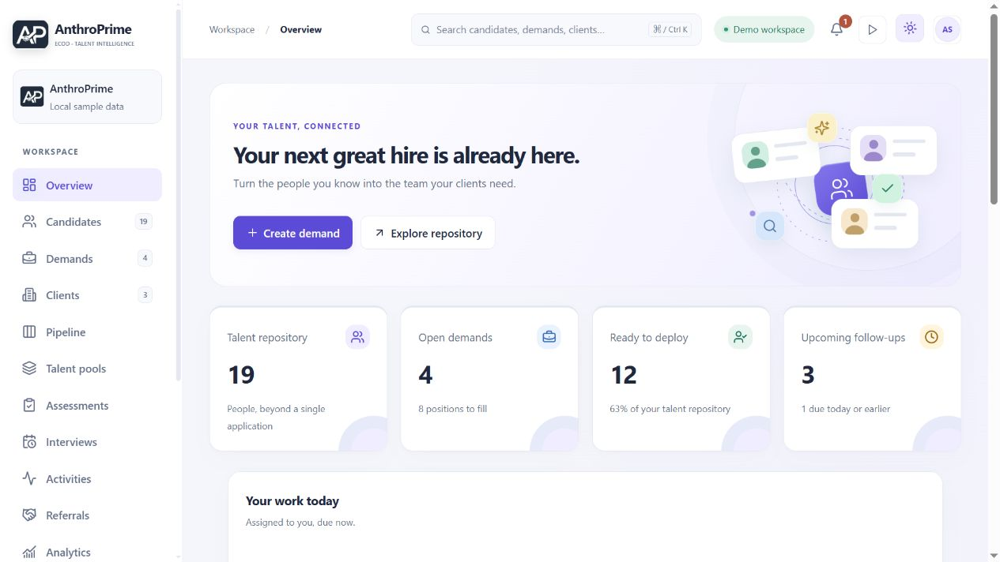
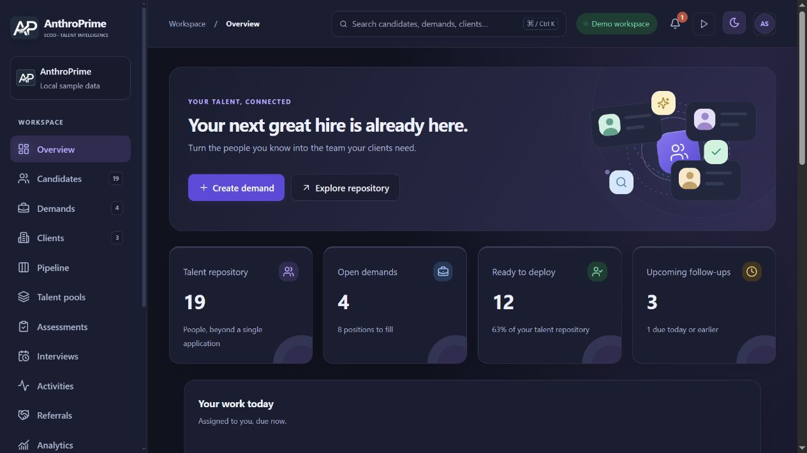
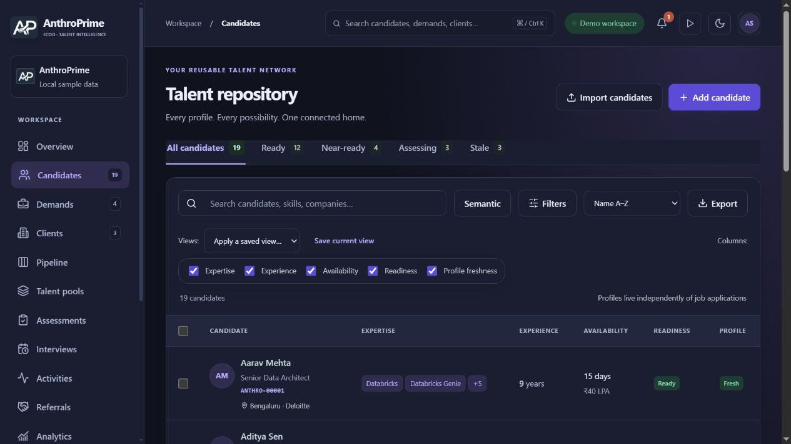
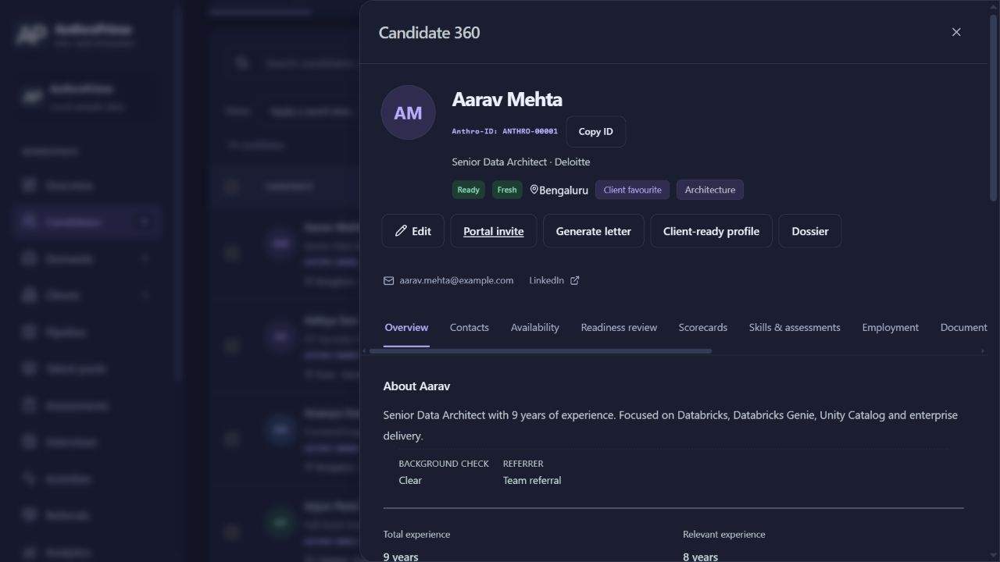
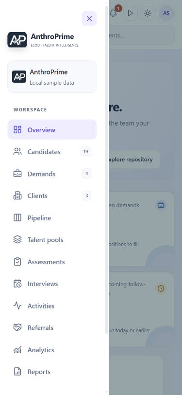
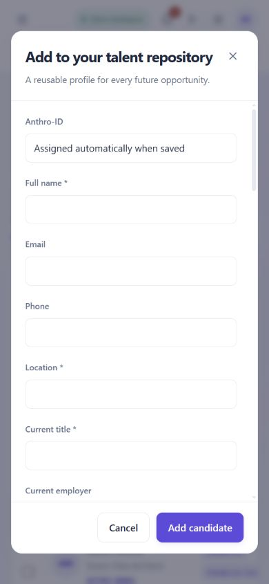

# UI/UX experience milestone — 8 October 2026

This release rebuilds the shared visual foundation across staff, careers, candidate and client entry points. It adds no database migration, service, dependency or Netlify function. Feature authority, permissions, reviewed writes and provider acceptance gates retain their existing contracts. Changes are committed locally only.

## Visual foundation

`src/experience.css` is the final shared visual layer. Existing component layouts remain in their original stylesheets; the new layer owns the palette, surfaces, typography, control treatment and motion contracts. It deliberately overrides older high-specificity dark variants so a lazy-loaded feature cannot bring back an unrelated palette. All four entry points import it.

Light mode uses an ivory canvas, white surfaces, restrained violet accents and semantic green, amber, red and blue states. Dark mode uses layered midnight surfaces, light violet accents, readable muted text and matching semantic state colours. Forms, tables, navigation, cards, dialogs, drawers, status chips, empty states, advanced workflow panels and public pages share these tokens.

The redesigned shell includes a quiet sidebar, clear active navigation, integrated workspace search, rounded controls and a responsive overview hero. Cards use subtle depth and hover movement; tables use consistent spacing, dividers and selection states. Horizontal scrolling stays inside tables, tabs and the pipeline rather than widening the page.

## Interaction and accessibility

- Page and dialog entrances use short opacity/transform animations. Existing decorative talent artwork adopts the same palette. No animation library or JavaScript frame loop was added.
- The existing motion control pauses the new animations and transitions. Operating-system reduced-motion preferences disable them independently. Forced-colour controls retain visible borders.
- Keyboard focus rings, native labelled inputs, readable disabled states and semantic status text remain available. State is communicated by text as well as colour.
- Mobile navigation now has a close button, expanded/control semantics, Escape handling, a keyboard focus loop, scroll restoration and focus return. Resizing to desktop closes it. Opening workspace/account dialogs closes the menu first to avoid competing scroll locks.
- `public/appearance.js` applies saved theme and motion preferences before React paints, follows system appearance by default and works when local storage is blocked. It reads display preferences only. All four HTML documents load it; Netlify packaging includes the file.
- Client pages now use the same theme and motion controls, with a styled sign-in shell. Hosted client authentication remains a separate acceptance check.

## Layout and presentation fixes

Candidate profile identity and actions now occupy separate rows. Long action lists no longer squeeze the candidate name or overflow the drawer. Contacts and actions wrap, while profile tabs scroll within their own strip. Browser inspection confirmed the reviewed desktop drawer has equal client/scroll widths (803 pixels).

Pipeline cards put the candidate name and Anthro-ID on separate lines, preserving compact identity without crowding the avatar. Offer summaries and draft emails now display the LPA unit once; the shared money formatter already supplies it.

Long mobile forms retain one scrolling content area and visible save/cancel controls. Administration, completion and foundation controls use shared fieldsets, button treatment and flexible label widths instead of cramped bare controls.

## Verification and limits

Browser review used the application's fictional local sample data. All twelve main navigation screens rendered at desktop size without document overflow. Mobile review at 390 pixels covered the dashboard, repository, demands, clients, pipeline, pools, assessments, interviews, activities, referrals, analytics and reports, plus menu and candidate form interactions. Careers and candidate portal pages were reviewed in dark mode; the client page's unconfigured-cloud state was checked. Profile actions were inspected before and after the overflow repair. No browser console errors were recorded.

The production package was previewed separately. Offline Netlify packaging passes with all **28 functions** and a **69.7 KiB main entry** against the 100 KiB budget. Lazy-loaded feature areas remain intact. These checks establish local packaging and layout; they do not constitute a device FPS benchmark, a formal accessibility certification or live hosted/provider acceptance.

Three focused tests pass for first-paint preferences, blocked storage/system preferences, and mobile focus/Escape/scroll restoration/account-dialog behavior. **The complete Node regression suite passed all 1,061 tests**, with zero failures, skips or cancellations (544 seconds). ESLint and repository formatting checks passed; the first-paint script, shared CSS and HTML entry points also passed explicit lint/format checks. Expected jsdom navigation/React test-harness warnings do not constitute browser errors.

No schema change is needed beyond the existing completion release endpoint `20261008131516_completion_workflows.sql`. Deploy the built frontend, including `appearance.js` and the generated CSS/JS assets, together. Existing provider configuration and operating acceptance requirements remain as documented in the deployment guide.

## Screenshots

